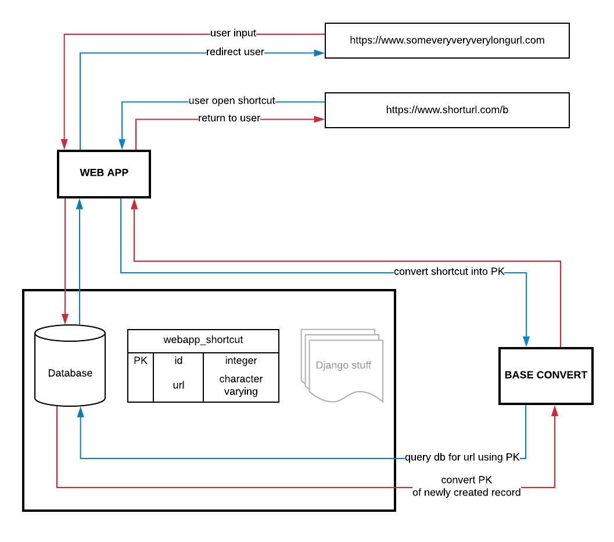

# ucu
URL's cutter webapp.

#### Why did I build this app?
I want to demonstrate, and improve my django skills. 
I tried to build possible most simple, fast and robust URL cutter, I can build within a couple of hours. 
The assumption was the public availability of shortened URLs, 
so there is no security here, anyone who knows BASE_SYMBOLS can download all addresses saved in the database.

#### How it work?
Check out [live demo](https://ucu.herokuapp.com/).

<small>! Note that Heroku free hosting goes in suspended after a couple of minutes of inactivity, 
so please forgive me if the application starts with a few seconds delay.</small>

 * conception diagram:
 

 * how custom base convert works:
 

#### How it looks?

 * Nothing fancy, just bootstrap.
 

#### Main requirements:
 - [x] accept URL from (anonymous) user
 - [x] generate a shortened URL in the form `<your domain>/<shortcut>`
 - [x] provide the shortened URL to the user
 - [x] in the admin interface a list of all URLs with their short version should be visible
 - [x] after going to your `<domain>/<shortcut>`, the application should redirect to the original address provided for shortening.

#### Technologies:
 * Django 2.2
 * PostgreSQL
 * gunicorn
 * Bootstrap

#### What I learned?
* Simple is better than complex.
* Dealing with static files when deploying on Heroku Cloud was a kind of a pain in.. .

#### TODO
* custom shortcuts for registered users
* traffic monitor for registered users